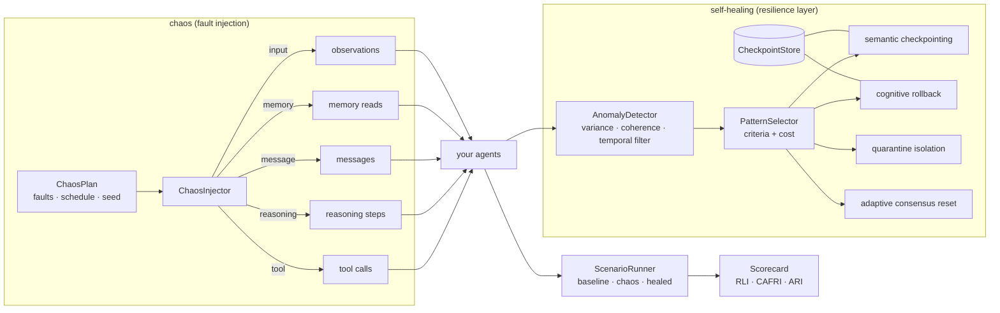

# agent-chaos-engineering

**Chaos engineering and self-healing recovery patterns for multi-agent LLM systems.**

[](https://github.com/nunar-nexus-forge/agent-chaos-engineering/actions/workflows/ci.yml)
[](https://pypi.org/project/agent-chaos-engineering/)
[](pyproject.toml)
[](LICENSE)

*Chaos Monkey for AI agents.* Inject **hallucination loops, tool failures, network delays,
cyclic dependencies, stale memory, miscoordination** and **adversarial input perturbations**
into a LangGraph / LangChain / plain-Python agent system, watch it degrade, then ship the fix:
four **cognitive-layer recovery patterns** that detect and heal reasoning failures without
a human in the loop.

`agent-chaos-engineering` has two halves:

* **Self-healing** - the fault taxonomy, the anomaly detectors, the four recovery patterns
  (semantic checkpointing, cognitive rollback, quarantine isolation, adaptive consensus
  reset), the pattern-selection rules and the resilience scorecard;
* **Adversarial resilience** - resilience zones, redundant inference paths with
  trust-weighted decision fusion, cross-path consistency checks, a supervisory control layer
  with audit logging, and the adversarial fault kinds (input perturbation, data poisoning,
  perception spoofing).

Nothing here needs an API key: the built-in simulation and every test run offline.

> **Naming:** the distribution is `agent-chaos-engineering`; the import is `import agent_chaos`
> and the CLI is `agent-chaos <command>`.

---

## Install

```bash
pip install agent-chaos-engineering                  # pure Python, no dependencies
pip install 'agent-chaos-engineering[langgraph]'     # + LangGraph / LangChain adapters
pip install agent-chaos-engineering multi-agent-observability   # + log injections/recoveries into MA-Trace episodes (import ma_trace)
```

## 60-second tour

### Break things

```python
from agent_chaos import ChaosInjector, ChaosPlan

chaos = ChaosInjector(ChaosPlan.standard(seed=1), agents=["planner", "executor"])


@chaos.tool("search", agent="executor")  # errors in 5 % of calls, 50-500 ms delays
def search(query: str) -> list[str]: ...


@chaos.reasoning_step("planner")  # 3 % of outputs become hallucinations
def plan(goal: str) -> str: ...


delivery = chaos.message("planner", "executor", plan("ship it"))  # may be dropped / rerouted / delayed
if delivery.delivered:
    executor.handle(delivery.content)

memory = chaos.memory({}, agent="planner")  # reads may return stale versions
observation = chaos.input("sensor", reading)  # adversarial noise / spoofing

print(chaos.summary())  # every injection is logged for post-hoc analysis
```

`ChaosPlan.standard()` is the standard operational-fault plan (network delays 50-500 ms,
tool errors in 5 % of calls, hallucination loops in 3 % of reasoning steps, cyclic
dependencies), distributed round-robin so every fault kind gets equal exposure. `ChaosPlan.adversarial()` adds input perturbation, data poisoning and
perception spoofing; `ChaosPlan.full()` has everything. Plans are plain JSON you can edit:
`agent-chaos plan --preset full -o plan.json`.

### Heal them

```python
from agent_chaos import SelfHealer, HealingConfig

healer = SelfHealer(
    agents=["planner", "executor", "critic"],
    dependencies={"executor": ["planner"], "critic": ["executor"]},  # who consumes whose output
    config=HealingConfig(coherence_threshold=0.85, variance_sigma=1.5, min_consecutive=2),
)

# at decision points, when the state is known-good:
healer.checkpoint("planner", state, coherence=1.0)

# after every output:
signal, action = healer.heal(
    "planner",
    task="ticket-42",
    output=answer,
    constraints=[cites_sources, within_budget, no_contradiction],  # -> semantic coherence
    accuracy=0.9,  # optional, drives consensus weights
)
if action and action.kind == "restore":
    state = action.state  # semantic checkpointing / cognitive rollback
if action and action.kind == "quarantine":
    route_around(action.agents)  # quarantine isolation
if action and action.kind == "reweight":
    weights = action.weights  # adaptive consensus reset
```

Detection: an anomaly is raised when the agent's **reasoning
variance** from its peers exceeds `mean + 1.5σ` of its own history **or** its **semantic
coherence** (constraints satisfied / total) drops below `0.85`, and *confirmed* only after
`min_consecutive` consecutive observations. Recovery selection first applies each pattern's
matching criteria, then minimises
`recovery_time + w_impact · affected_agents + w_accuracy · (1 − accuracy_retention)`:

| pattern | when it matches | what it does |
|---|---|---|
| semantic checkpointing | failure < 5 s, one agent affected, coherence drop < 15 % | restore the last checkpoint whose coherence ≥ threshold |
| cognitive rollback | failure > 5 s, propagation depth > 2, checkpoint validity ≥ 0.90 | restore `argmax(coherence − λ·age)` for every degraded agent |
| quarantine isolation | > 1 agent affected, cascading risk > 0.70, system can run degraded | detach degraded agents, route around them, re-admit after probation |
| adaptive consensus reset | several agents degraded, variance > 2σ, alternatives available | `w_i ← w_i · (1 + α (accuracy_i − 0.85))`, so reliable agents gain influence |

Every incident records its context, the chosen pattern, the alternatives with their costs,
and the measured recovery latency (`healer.report()`).

### Measure

```python
from agent_chaos import ScenarioRunner, ChaosPlan
from agent_chaos.sim import pipeline_scenario  # or your own scenario function

result = ScenarioRunner(pipeline_scenario, plan=ChaosPlan.standard(), episodes=30, seed=1).run()
print(result.scorecard.to_markdown())
```

```
| metric                        | baseline | chaos  | healed |
|---|---|---|---|
| task success (accuracy)       | 100.0%   | 63.3%  | 86.7%  |
| recovery latency (s)          | n/a      | 2.10   | 1.25   |
| cross-agent failure rate      | 0.0%     | 9.2%   | 3.8%   |
| decision integrity            | 100.0%   | 82.5%  | 94.6%  |
...
| recovery latency improvement (RLI)            | 40.5% |
| cross-agent failure rate improvement (CAFRI)  | 58.7% |
| accuracy retention improvement (ARI)          | 36.8% |
| composite reliability                         | 45.3% |
```

(Illustrative numbers from the bundled simulation; run it yourself with
`agent-chaos run --episodes 30`.) The runner executes three *arms* with identical seeds -
**baseline** (no chaos), **chaos** and **healed** (chaos + `SelfHealer`) - and reports task
success, accuracy retention, recovery latency, cross-agent failure rate (CAFR), recovery
success per fault kind, decision integrity, availability and compute overhead, plus the
improvement metrics **RLI**, **CAFRI**, **ARI** and the weighted composite.

Your own scenario is a function `f(ctx: ScenarioContext) -> ScenarioOutcome` that runs one
episode using `ctx.chaos` (the injector), `ctx.healer` (`None` on non-healed arms),
`ctx.rng` and `ctx.clock` (virtual time, so injected delays cost nothing real). See
`src/agent_chaos/sim.py` for a complete example.

## Adversarial resilience

```python
from agent_chaos import ResilienceZone, ZoneSupervisor, TrustWeightedDecision

# resilience zones: isolate the zone where an anomaly is confirmed, restore its local checkpoint,
# block dangerous actions while it is isolated, keep an audit log
zones = [ResilienceZone("perception", ["camera"]), ResilienceZone("inference", ["model_a", "model_b"])]
supervisor = ZoneSupervisor(zones, dangerous_actions={"brake_release"})
action = supervisor.observe(
    "model_a", task="frame-17", output=score, coherence=0.4
)  # -> isolate / restore / release
allowed = supervisor.allow("model_a", "brake_release")

# redundant inference paths + trust-weighted decision fusion + cross-path consistency
fusion = TrustWeightedDecision(["path_a", "path_b", "path_c"], discrepancy_threshold=0.5)
decision = fusion.decide(
    {"path_a": 0.81, "path_b": 0.79, "path_c": 0.05}
)  # path_c suppressed, flagged adversarial
fusion.feedback(truth=0.8, outputs=...)  # trust weights learn
```

The adversarial fault kinds (`InputPerturbation`, `DataPoisoning`, `PerceptionSpoofing`)
let you run a DevSecOps-style loop: inject, detect, patch, re-run.

## LangGraph

```python
from langgraph.checkpoint.memory import InMemorySaver

from agent_chaos.adapters.langgraph import chaos_node, heal_node, SelfHealingCheckpointSaver

builder.add_node("planner", chaos_node(planner, chaos))  # inject into a node
builder.add_node(
    "writer", heal_node(writer, healer, coherence=score_update)
)  # checkpoint / detect / restore a node

saver = SelfHealingCheckpointSaver(InMemorySaver(), coherence=score_state)  # any checkpointer
graph = builder.compile(checkpointer=saver)
...
if saver.needs_rollback(thread_id):
    graph.invoke(None, config=saver.best_valid_config(thread_id))  # resume from the best valid checkpoint
```

`SelfHealingCheckpointSaver` wraps any LangGraph checkpointer (memory, SQLite, Postgres),
tags each checkpoint with a coherence score computed from the state, and finds the
checkpoint maximising `coherence − λ · age` - LangGraph time travel with a semantic
validity criterion. For LangChain tools use `agent_chaos.adapters.langchain.chaos_tool`.

## CLI

```
agent-chaos faults                     # the taxonomy with surfaces and default rates
agent-chaos presets                    # standard / adversarial / full plans
agent-chaos plan --preset full -o plan.json
agent-chaos run [--scenario pkg.mod:fn] [--preset standard|--plan plan.json] [--episodes 30] [--seed 1] [--json results.json]
agent-chaos report results.json
```

## Architecture



## Scope

The bundled simulation (`agent_chaos.sim`) is a harness for exercising the mechanics, not a
benchmark: the scorecard numbers it produces are its own, and the library makes no claims
about your system until you run your own scenario through it. Longer documents live in
`docs/`: [recovery-patterns.md](docs/recovery-patterns.md) (selection inputs and what each
pattern returns) and [scorecard.md](docs/scorecard.md) (every metric, and how to write a
scenario). To cite the software, use [CITATION.cff](CITATION.cff).

## Companion projects

- [`multi-agent-observability`](https://github.com/nunar-nexus-forge/multi-agent-observability) - causal tracing, coordination SLOs and deterministic replay (install both and call `agent_chaos.adapters.ma_trace.bind_ma_trace` to log every injection and recovery into the current episode).
- [`agent-tool-guardrails`](https://github.com/nunar-nexus-forge/agent-tool-guardrails) - policy contracts for agent-tool calls with a tamper-evident evidence store and an MCP proxy.

## Contributing

See [CONTRIBUTING.md](CONTRIBUTING.md). Most wanted: new fault kinds (prompt injection,
token-budget exhaustion, schema drift), adapters (CrewAI, AutoGen, OpenAI Agents SDK), and
real-world scenarios for the runner.

```bash
git clone https://github.com/nunar-nexus-forge/agent-chaos-engineering && cd agent-chaos-engineering
make sync && make check        # everything lives in ./.venv
python examples/demo_pipeline.py
```

## License

Apache License 2.0 - see [LICENSE](LICENSE) and [NOTICE](NOTICE).
